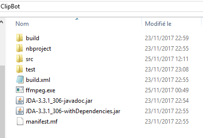

ClipBot by delevoye977
===================

The purpose of this bot is to record Discord voice channels and then clip the last seconds (as in Twitch clips).

Warning:
-------------
Please note that it is illegal to record a conversation without the approbation of everyone recorded. I am not responsible of how you use the application.

I don't think that I will maintain the application, feel free to use and modify !

Be gentle with the bot, it isn't really efficient and can crash if pushed too far (which is not really far away).

How to use:
-----------------
First of all put your bot token in *ClipBot.java*.

Then change the parameter NUMBER_OF_SECONDS_TO_RECORD in the *AudioStorage.java*.

In the class *MyMessageHandler.java* you can change the caracter for your bot commands (currently it's "ù" since the button is useless on my french keyboard). And you can also change the text for the commands.

Finally : Put a "ffmpeg.exe" at the root of the folder. (You can find it at https://www.ffmpeg.org/ ).

Commands:
-----------------
**ùtest** : the bot will answer you, it is only used to know whether the bot works or not.

**ùcome** : the bot will come into your current voice channel. The bot will start recording.

**ùquit** : the bot will disconnect and the program will shutdown.

**ùmlk** [name] : This is the main function of the bot. Launches the transcoding from bytes to MP3 and then sends the file. The name parameter is optionnal.

Credits:
======
The bot is based on the unofficial API JDA. You can join the very active community here : https://github.com/DV8FromTheWorld/JDA/

FFMPEG : Gave me this awesome library to convert audio files : https://www.ffmpeg.org/
